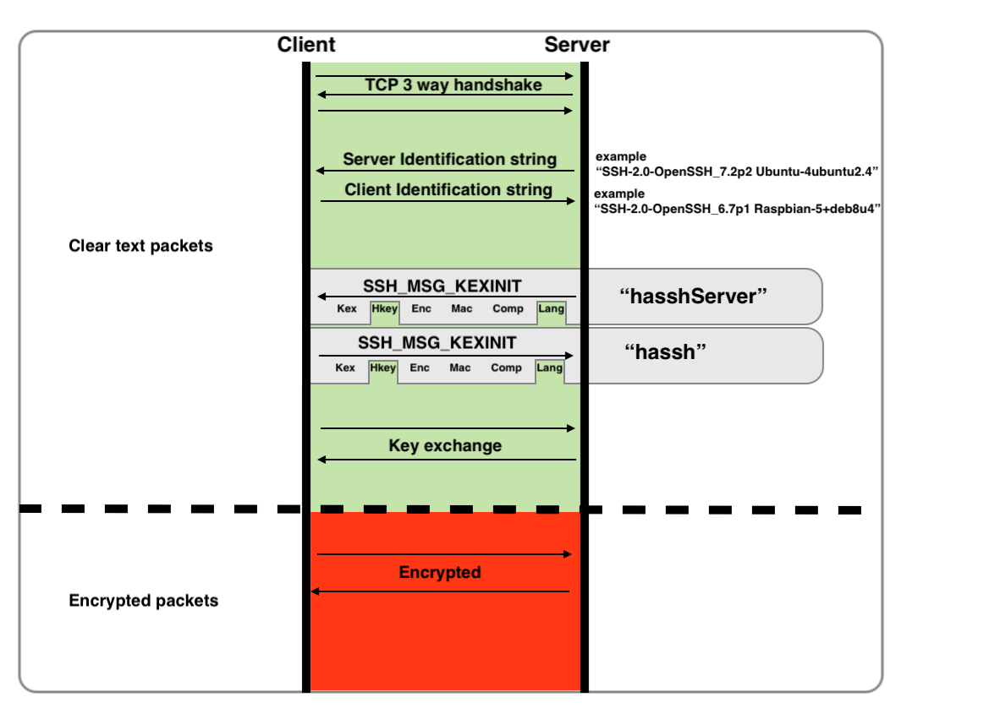

# "HASSH" - a Profiling Method for SSH Clients and Servers.

<p align="center">
  
  
</p>


"HASSH" is a network fingerprinting standard which can be used to identify specific Client and Server SSH implementations. The fingerprints can be easily stored, searched and shared in the form of an MD5 fingerprint.

[](https://opensource.org/licenses/BSD-3-Clause)
## What can HASSH help with:
- Use in highly controlled, well understood environments, where any fingerprints outside of a known good set are alertable.
- It is possible to detect, control and investigate brute force or Cred Stuffing password attempts at a higher level of granularity than IP Source - which may be impacted by NAT or botnet-like behaviour. The hassh will be a feature of the specific Client software implementation being used, even if the IP is NATed such that it is shared by many other SSH clients.
- Detect covert exfiltration of data within the components of the Client algorithm sets. In this case, a specially coded SSH Client can send data outbound from a trusted to a less trusted environment within a series of SSH_MSG_KEXINIT packets. In a scenario similar to the more known exfiltration via DNS, data could be sent as a series of attempted, but incomplete and unlogged connections to an SSH server controlled by bad actors who can then record, decode and reconstitute these pieces of data into their original form.  Until now such attempts - much less the contents of the clear text packets - are not logged even by mature packet analyzers or on end point systems. Detection of this style of exfiltration can now be performed easily by using anomaly detection or alerting on SSH Clients with multiple different hassh
- Use in conjunction with other contextual indicators, for example detect Network discovery and Lateral movement attempts by unusual hassh such as those used by Paramiko, Powershell, Ruby, Meterpreter, Empire.
- Share malicious hassh as Indicators of Compromise.
- Create an additional level of Client application control, for example one could block all Clients from connecting to an SSH server that are outside of an approved known set of hassh values.
- Contribute to Non Repudiation in a Forensic context - at a higher level of abstraction than IPSource -  which may be impacted by NAT, or where multiple IP Sources are used.
- Detect Deceptive Applications. Eg a hasshServer value known to belong to the Cowry/Kippo SSH honeypot server installation, which is purporting to be a common OpenSSH server in the Server String.
- Detect devices having a hassh known to belong to IOT embedded systems. Examples may include cameras, mics, keyloggers, wiretaps that could be easily be hidden from view and communicating quietly over encrypted channels back to a control server. 

## How does HASSH work:
"hassh" and "hasshServer" are MD5 hashes constructed from a specific set of algorithms that are supported by various SSH  Client and Server Applications. These algorithms are exchanged after the initial TCP three-way handshake as clear-text packets known as "SSH_MSG_KEXINIT" messages, and are an integral part of the setup of the final encrypted SSH channel. 
The existence and ordering of these algorithms is unique enough such that it can be used as a fingerprint to help identify the underlying Client and Server application or unique implementation, regardless of higher level ostensible identifiers such as "Client" or "Server" strings.  
<p align="center">

</p>  

## Example 1: Client Fingerprinting - the "hassh"
For the "Cyberduck" SFTP client (specifically SSH-2.0-Cyberduck/6.7.1.28683 (Mac OS X/10.13.6) (x86_64)" , the set of supported algorithms is as follows :

|Function|Algorithms seen in SSH_MSG_KEXINIT packets|
| ------------- | ------------- |
|Key Exchange methods|```curve25519-sha256@libssh.org,diffie-hellman-group-exchange-sha256,ecdh-sha2-nistp521,ecdh-sha2-nistp384,ecdh-sha2-nistp256,diffie-hellman-group-exchange-sha1,diffie-hellman-group1-sha1,diffie-hellman-group14-sha1,diffie-hellman-group14-sha256,diffie-hellman-group15-sha512,diffie-hellman-group16-sha512,diffie-hellman-group17-sha512,diffie-hellman-group18-sha512,diffie-hellman-group14-sha256@ssh.com,diffie-hellman-group15-sha256,diffie-hellman-group15-sha256@ssh.com,diffie-hellman-group15-sha384@ssh.com,diffie-hellman-group16-sha256,diffie-hellman-group16-sha384@ssh.com,diffie-hellman-group16-sha512@ssh.com,diffie-hellman-group18-sha512@ssh.com```|
|Encryption| ```aes128-cbc,aes128-ctr,aes192-cbc,aes192-ctr,aes256-cbc,aes256-ctr,blowfish-cbc,blowfish-ctr,cast128-cbc,cast128-ctr,idea-cbc,idea-ctr,serpent128-cbc,serpent128-ctr,serpent192-cbc,serpent192-ctr,serpent256-cbc,serpent256-ctr,3des-cbc,3des-ctr,twofish128-cbc,twofish128-ctr,twofish192-cbc,twofish192-ctr,twofish256-cbc,twofish256-ctr,twofish-cbc,arcfour,arcfour128,arcfour256```|
|Message Authentication|```hmac-sha1,hmac-sha1-96,hmac-md5,hmac-md5-96,hmac-sha2-256,hmac-sha2-512```|
|Compression|```zlib@openssh.com,zlib,none```|

Concatenating these algorithms together with a delimiter of ";" gives the hasshAlgorithms, which is useful for detailed analysis.  
```curve25519-sha256@libssh.org,diffie-hellman-group-exchange-sha256,ecdh-sha2-nistp521,ecdh-sha2-nistp384,ecdh-sha2-nistp256,diffie-hellman-group-exchange-sha1,diffie-hellman-group1-sha1,diffie-hellman-group14-sha1,diffie-hellman-group14-sha256,diffie-hellman-group15-sha512,diffie-hellman-group16-sha512,diffie-hellman-group17-sha512,diffie-hellman-group18-sha512,diffie-hellman-group14-sha256@ssh.com,diffie-hellman-group15-sha256,diffie-hellman-group15-sha256@ssh.com,diffie-hellman-group15-sha384@ssh.com,diffie-hellman-group16-sha256,diffie-hellman-group16-sha384@ssh.com,diffie-hellman-group16-sha512@ssh.com,diffie-hellman-group18-sha512@ssh.com;aes128-cbc,aes128-ctr,aes192-cbc,aes192-ctr,aes256-cbc,aes256-ctr,blowfish-cbc,blowfish-ctr,cast128-cbc,cast128-ctr,idea-cbc,idea-ctr,serpent128-cbc,serpent128-ctr,serpent192-cbc,serpent192-ctr,serpent256-cbc,serpent256-ctr,3des-cbc,3des-ctr,twofish128-cbc,twofish128-ctr,twofish192-cbc,twofish192-ctr,twofish256-cbc,twofish256-ctr,twofish-cbc,arcfour,arcfour128,arcfour256;hmac-sha1,hmac-sha1-96,hmac-md5,hmac-md5-96,hmac-sha2-256,hmac-sha2-512;zlib@openssh.com,zlib,none```

Finally the hassh is simply the MD5 of hasshAlgorithms, and is used for storage, searching and sharing. Some examples follow:

```de30354b88bae4c2810426614e1b6976```  Powershell Renci.SshNet.SshClient.0.0.1 (used by Empire exploit modules)
```fafc45381bfde997b6305c4e1600f1bf```  Ruby/Net::SSH_5.0.2 x86_64-linux (used by Metasploit exploit modules)
```b5752e36ba6c5979a575e43178908adf```	Python Paramiko_2.4.1 (used by Metasploit exploit modules) 
```16f898dd8ed8279e1055350b4e20666c```	Dropbear_2012.55 (used in IOT embedded systems)  
```8a8ae540028bf433cd68356c1b9e8d5b```	CyberDuck Version 6.7.1 (28683)  
```06046964c022c6407d15a27b12a6a4fb```	OpenSSH_7.7p1 Ubuntu-4  

## Example 2: Server Fingerprinting - the "hasshServer"
For a standard SSH-2.0-OpenSSH_5.3 SSH server, the set of supported algorithms is as follows :

|Function|Algorithms seen in SSH_MSG_KEXINIT packets|
| ------------- | ------------- |
|Key Exchange methods| ```diffie-hellman-group-exchange-sha256,diffie-hellman-group-exchange-sha1,diffie-hellman-group14-sha1,diffie-hellman-group1-sha1```|
|Encryption| ```aes128-ctr,aes192-ctr,aes256-ctr,arcfour256,arcfour128,aes128-cbc,3des-cbc,blowfish-cbc,cast128-cbc,aes192-cbc,aes256-cbc,arcfour,rijndael-cbc@lysator.liu.se```|
|Message Authentication|```hmac-md5,hmac-sha1,umac-64@openssh.com,hmac-ripemd160,hmac-ripemd160@openssh.com,hmac-sha1-96,hmac-md5-96```|
|Compression|```none,zlib@openssh.com```|

Concatenating these algorithms together with a delimiter of ";" gives the hasshServerAlgorithms, which is useful for detailed analysis.  
```diffie-hellman-group-exchange-sha256,diffie-hellman-group-exchange-sha1,diffie-hellman-group14-sha1,diffie-hellman-group1-sha1;aes128-ctr,aes192-ctr,aes256-ctr,arcfour256,arcfour128,aes128-cbc,3des-cbc,blowfish-cbc,cast128-cbc,aes192-cbc,aes256-cbc,arcfour,rijndael-cbc@lysator.liu.se;hmac-md5,hmac-sha1,umac-64@openssh.com,hmac-ripemd160,hmac-ripemd160@openssh.com,hmac-sha1-96,hmac-md5-96;none,zlib@openssh.com```

Finally the hasshServer is simply the MD5 of hasshServerAlgorithms, some examples follow:
```c1c596caaeb93c566b8ecf3cae9b5a9e``` SSH-2.0-dropbear_2016.74	  
```d93f46d063c4382b6232a4d77db532b2``` SSH-2.0-dropbear_2016.72	  
```2dd9a9b3dbebfaeec8b8aabd689e75d2``` SSH-2.0-AWSCodeCommit  
```696e7f84ac571fdf8fa5073e64ee2dc8``` SSH-2.0-FTP   

## References:
- [RFC4253 The Secure Shell (SSH) Transport Layer Protocol](https://www.ietf.org/rfc/rfc4253.txt)
- [Salesforce Engineering blog](https://engineering.salesforce.com/open-sourcing-hassh-abed3ae5044c)

## Credits:
hassh and hasshServer were conceived and developed by [Ben Reardon](mailto:breardon@salesforce.com) ([@benreardon](https://twitter.com/@benreardon)) within the Detection Cloud Team at Salesforce, with inspiration and contributions from [Adel Karimi](mailto:akarimishiraz@salesforce.com) (@0x4d31) and the [JA3 crew](https://github.com/salesforce/ja3/)  crew:[John B. Althouse](mailto:jalthouse@salesforce.com)  , [Jeff Atkinson](mailto:jatkinson@salesforce.com) and [Josh Atkins](mailto:j.atkins@salesforce.com)
